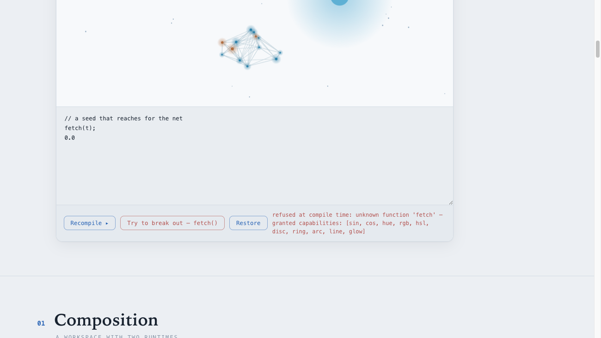
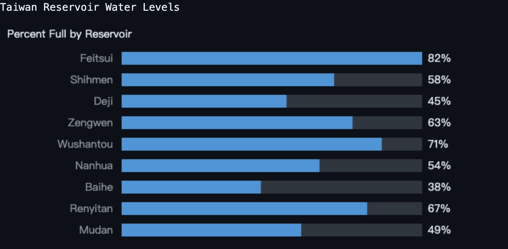
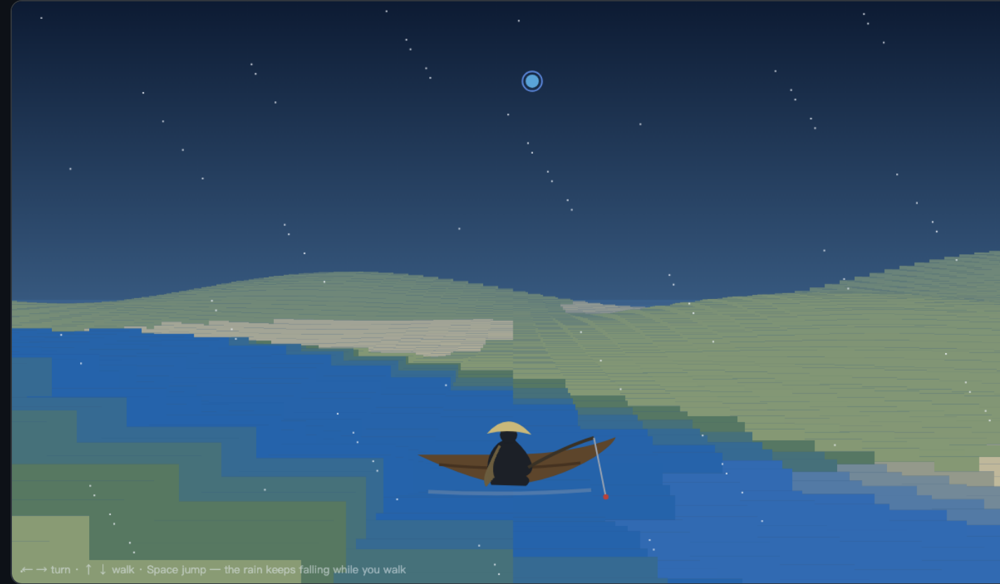

# wasm-jit

**Software with no fixed screen.** You say what you want — a chart of this week's rainfall, a lone fisherman on a snowy river — and the interface is generated and shown in milliseconds. The catch that makes it safe: everything generated is fenced so it can only do what you explicitly allow.

**🌊 Live: [arcana.boo](https://arcana.boo)** — the full anatomy of this architecture, with a playground where the wasm-jit compiler runs *in your browser*: edit a seed script, watch it recompile to WASM in milliseconds, and try to `fetch()` — refused at compile time, live.



> The one-minute falsification, from the live playground: a seed that calls `fetch()` is **refused at compile time** — *"unknown function 'fetch' — granted capabilities: [sin, cos, hue, rgb, hsl, disc, ring, arc, line, glow]"*. The fence is the import table; a capability never granted cannot be seized, however clever the generator.



> Typed *"a bar chart of Taiwan's reservoir water levels, in English"* → a fuel-metered WASM cell renders it in ~1.4 ms, no chart library. *(Bar values are generated from the prompt, not live data.)*

Today's apps ship a fixed set of screens. This is the opposite — there is no pre-built UI; it manifests from your intent. And because anything generated on the fly is a security risk, every piece compiles to a tiny WebAssembly "cell" whose entire world is the permissions you hand it: it literally cannot reach the network, the filesystem, or anything not on its list. **Fast**, because the browser runs it near-native; **safe**, because it can only touch what you granted.

> **中文一句話**:App 不再有固定畫面。你說要什麼,介面當下生成——而生成的東西**只能碰你允許的**。快,因為瀏覽器近原生跑它;安全,因為它只夠得著你授權的那張清單。

**Where this sits.** The field calls this *generative UI*, and most tools (v0, bolt, Lovable) have the model write ordinary code you then run as-is. wasm-jit takes the safer end of that spectrum: the interface is *composed from a fixed vocabulary*, never arbitrary code, and compiled into a capability-fenced WASM cell — safe by construction, not by review. That is the whole bet.



> The same substrate scales to a whole *living* world — this is `worlds/moon4.json`, the Tang poem 楓橋夜泊 (*Mooring by Maple Bridge at Night*) grown from nothing but vocabulary: a maple bridge, a boat with its fishing lantern, 寒山寺 with the bell hanging inside it, a moon on the western ridge, crows, fish, frost falling all night. Terrain, weather, every body, skin, behaviour and *voice* is a separate capability-fenced cell — beings can beget, repaint themselves, name themselves, sense one another (§20–§21), carry true 3D bodies (§22b) and make their own sound (§24), while none can touch anything it wasn't granted. No cell knows the whole; the world emerges.

---

## How it works

**Core claim**: compile a script to WASM bytes at runtime → `WebAssembly.instantiate()` → the browser engine JITs it → **near-native speed + a capability sandbox + synchronous calls**, the only path where all three hold at once. Measured on par with the AOT ceiling and tied with hand-written JS on speed — but it buys a property JS can't give: **the manifested code need not be trusted** (the import table *is* its entire world).

> **Origin & acknowledgment**: this idea began from wanting a *sandboxed* runtime scripting language. We first prototyped against [Rhai](https://github.com/rhaiscript/rhai) and found that a tree-walking interpreter trades native speed for its sandbox — wasm-jit wants both. **Thank you to Rhai for the spark**; it shaped the whole direction. The project no longer contains Rhai (the comparison framing is gone too), returning to its own thesis: native speed *inside* a sandbox.

Theory: `docs/multidimensional-composition-architecture.md` — the full design essay (§0–§21; §16 execution layer, §17 the AI-era frontend, §19 the shared world-field). A Traditional-Chinese, Buddhist-perspective edition sits alongside at `docs/multidimensional-composition-architecture.zh-TW.md`.

## PoC overview

**Standalone pages:**
1. **`index.html` — benchmark**: one script run three ways (generated WASM / JS / AOT Rust); shows generated WASM = AOT ceiling and tied with JS.
2. **`canvas.html` — canvas**: 2000 components, each with its own independently generated WASM kernel cell, all run every frame at 60fps.
3. **`draw.html` — freeform draw**: 7 drawing primitives; a smiling Buddha / a full-body Guanyin on a lotus throne, manifested from DSL seeds (`examples/*.dsl`).

**`leptos-poc/` — pure-Rust CSR (Leptos 0.8), seven tabs** (zero hand-written JS, paired with `api-server`):
| Tab | What it proves |
|---|---|
| DynamicCell | behavior is dynamic: live-edit a script → cell drives a signal → reactive DOM update |
| Form | 9 widget kinds driven by a schema (server reads the JSON from disk per request — edit + reload to change it); validation/computed fields = DSL cells; departments/members via a real Axum API |
| Tokens | style as capability: SCSS emits `--tk-*` rails; a style spec may only reference tokens, raw CSS is rejected |
| Layout | layout as schema: the whole app shell (header / menu / profile / table) is manifested from a recursive JSON tree — the table's data source is data too |
| Freeform draw | pixel surface: Buddha/Guanyin read from DSL seeds; **+ "Buddha — AssemblyScript" = a real 637-byte asc-compiled seed running through the same import audit** |
| **3D voxel** | **a playable Minecraft-style world**: ←→ turn, ↑↓ walk, Space jump; true perspective + chase camera + infinite terrain + distance fog, **the renderer and physics all live in a ~2.4KB seed**; interaction via `key`/`get`/`set` (state itself is a granted capability) |
| Seed-language spectrum | **the fence is language-agnostic**: Tier 1 (DSL codegen) vs Tier 2 (external WASM via `Cell::from_wasm_bytes`'s import audit) — same ABI, bit-identical value; an over-reaching external seed (extra `env::fetch` import) is rejected |
| **LiveUI** | **the live-manifestation loop** (docs §18, implemented): one schema declares cells + widget tree + patches + wires; events run cells, outputs cascade along a **budgeted event bus** (a wiring cycle degrades into a report, not a hang), and a cell's verdict **gates structural patches** (vocabulary-validated before touching the tree). Every cell is **fuel-metered** and **supervised**: an injected runaway loop traps → degrades → quarantines → restartable — the page never freezes. Plus the **memory capability** (host writes an array into the cell's own exported memory, the cell reduces it via `load()`, cross-checked bit-exact) and live module-cache stats |

**Six surfaces, one fence**: 2D pixels (15 verbs incl. pointer + a host data root), forms (11 widgets — plus widgets the vocabulary **grows for itself**), layout, **3D scenes** (30 verbs), **per-pixel GPU shaders**, and living worlds. Generation composes vocabulary — and when the vocabulary is missing, it grows a fenced cell instead of emitting code.

**`gen-server/` — the LIVE generation demo (chat → real Claude → UI manifests)**, fully separate from the demos above (:8646):
a chat box drives **Claude CLI running in a Docker container** (no volume mounts; network is currently unrestricted — a documented limit, not a claim) → the returned seed is validated by **natively compiling it with wasm-jit on the server** (self-repair retries feed the compiler error back) → only a seed that compiles reaches the browser, where it manifests as fuel-metered capability cells. Two sandboxes, one thesis: **the generator is contained by the container; the generated is contained by the cell — nobody in the chain needs to be trusted.** Conversational iteration works (the prior schema rides along: "add a people count and show the per-person share" grew a 4-cell tip calculator to 6 cells in 10.8s, one attempt). UI logic cells get `sin/cos/get/set` (a 32-slot store makes multi-input math work); the widget vocabulary includes a **host-rendered chart set** (barchart/linechart/piechart/gauge — zero external deps; static data rides in the schema, live values bind to cells, and `init` fires cells at manifest so nothing shows "—"); a "draw a smiling sun" prompt switches to the 7-primitive pixel surface; and the **Field** (docs §19) — say 一座山 and a mountain rises on a shared 96×96 world-grid, say 下一場雨 and AI-written rain/flow/erosion cells make water fall, run downhill and carve the land: many cells, one field, no cell knows the whole — the landscape emerges, and a runaway world-cell is fuel-trapped and quarantined while the world keeps turning. Inhabitants can each carry their own live mind (a per-being Claude, docs §20) and even **beget** new beings — a painter paints a painter — under one rule: a child's capabilities are a subset of its parent's, the birth budget divides down, and the child's soul passes the same audit; creation itself attenuates, so permissions stay monotonically non-increasing to any depth (§21; the subset/audit fence is enforced in code — the 7/7 end-to-end run is a local, not-yet-committed harness). Measured: UI one-shot in ~8–22s, manifestation ~7ms for 4 cells — **generate slowly, manifest fast**, live.

**Seed-language spectrum** (§16): the fence is in the import table, not the grammar — so one sandbox holds many seed languages:
| Tier | Language | Fence entry | Proof |
|---|---|---|---|
| 1 | home DSL (f64-scalar: let/while/**if-else**/arithmetic+%/comparison + built-in min/max/abs/sqrt/floor) | codegen rejects ungranted functions | every DSL seed |
| 2 | **AssemblyScript** (TS syntax) / Rust→wasm / hand-written WAT | `Cell::from_wasm_bytes` audits import section ⊆ grants before instantiate | `assembly/buddha.ts` compiled by asc, drawn in the freeform-draw tab |

## Grown since the PoC — and it kept its fence

The world kept growing on the *same* fence: beings that are born, age by their own relativistic proper time, and die; a self-growing widget vocabulary; **3D bodies** with real shadows; **per-pixel GPU shaders**; a from-scratch **sound engine** whose beings speak and sing (a Rust WASM module with a machine-checked **empty import table** — a thing that can touch nothing, only vibrate); and apps that **persist, hold lists, keep text, and pull live data** — all with no cell ever gaining a capability it wasn't granted. **Richness is unbounded; reach is fixed.**

→ The full account (§19–§26, with each mechanism glossed in plain language) lives in **[docs/GROWN.md](docs/GROWN.md)**.

## The power of wasm-jit (vs JS, honest version)

Speed: on a pure f64 kernel it ties JS (V8's home turf). Ergonomics: JS still wins slightly (the DSL added if/%/built-in math but still has no functions/arrays/strings). The power is in five properties JS structurally cannot give:

| Property | JS `new Function` | wasm-jit cell |
|---|---|---|
| boundary of its world | ambient authority (whole page: fetch/document/cookies) | **the import table = the whole world** (the 3D game grants 12 capabilities; `fetch()` rejected at compile time) |
| memory | any closure / global | even state is granted (get/set, 32 slots) |
| determinism | by discipline | by construction: same input → bit-identical output → replayable/auditable |
| escape | prototype pollution + a history of sandbox escapes | memory isolation is a VM guarantee |
| cold code / frame time | must warm the JIT; GC/deopt tail | instantiate → near-native; zero allocation inside the cell |

The three ways to get isolation in JS each miss a corner: iframe (async), a sandboxable interpreter (one-to-two orders of magnitude slower), SES (immature). **"fast + isolated + synchronous" — only runtime-generated WASM gets all three.** One more layer: **grammar as fence** — the DSL can only express f64 math + granted calls, so "what this code can touch" is a compile-time-enumerable list. **JS runs code you trust; wasm-jit runs code you don't have to trust** — AI-generated / user-pasted / schema-carried manifestations can be *allowed* to come alive precisely because they live inside cells.

```
src (textarea, a small f64 seed language)
  → parser (Rust, recursive descent) → AST
      ├→ wasm-encoder → ~hundred-byte .wasm module → WebAssembly.instantiate() (engine JIT)
      ├→ same AST transpiled to JS → new Function (engine JS-JIT reference)
      └→ same kernel hand-written in Rust, AOT-compiled into the main module (ceiling reference)
```

Same source, three execution lanes, bit-identical values (identical f64 op order).

## Measured (2026-07-07, Apple Silicon Mac, Chrome headless=new)

Default kernel: `sum = sum + i*i - sum/(i+1)`, looped N times. exec = adaptive inner loop + median of samples.

| N | **generated WASM (engine JIT)** | JS `new Function` | AOT Rust (ceiling) | WASM vs AOT |
|---|---|---|---|---|
| 1e4 | **0.033 ms** | 0.055 ms | 0.033 ms | **1.0×** |
| 1e6 | **3.27 ms** | 3.33 ms | 3.27 ms | **1.0×** |
| 1e7 | **32.6 ms** | 32.3 ms | 31.2 ms | **1.04×** |

Compile cost (one-off): codegen 0.4–2.2 ms + instantiate ~0.6 ms; generated module **~117 bytes**.

**Conclusions:**
1. **Generated WASM = AOT ceiling (≈1.0×)** — the engine gives this numeric kernel a full-speed JIT; "borrowing the engine's JIT" has zero overhead.
2. **Tied with hand-written JS** (a pure f64 kernel is V8's JS-JIT home turf) — so the value of this path **is not speed**, it's: ① the capability sandbox (a generated module can only touch its imports + its own memory; `fetch()` rejected at compile time); ② deterministic replay (bit-identical values); ③ no GC, predictable frame time.
3. Compile cost ~1–3 ms, amortized once; only hot paths (called repeatedly) are worth compiling, run-once code can use other means → tiering: don't compile cold code, compile hot code to WASM.

## Canvas PoC — measured (canvas.html, 2026-07-07, same machine, headless Chrome)

Each component gets its **own unique script source** (4 templates × constants baked from the index, simulating "AI generates a behavior per component"), each compiled to its own WASM cell (**capability imports only `sin`/`cos`/`out` — the import table is the capability list**); kernel weight = number of while substeps. Both modes eat the same batch of scripts.

| Config | **generated WASM cells** | JS new Function |
|---|---|---|
| N=500 × 200 substeps (100k iters/frame) | **60fps · 1.17 ms · 7% of frame budget** | 60fps · 0.84 ms · 5% |
| N=2000 × 1000 (20× load, 2M iters/frame) | **60fps · 4.8 ms · 29%** (2000 cells / 78ms compile / 613KB) | 60fps · 4.4 ms · 27% |

**Canvas conclusions:**
1. **"every component is an agent with generated behavior" is routine engineering on WASM cells** (2000 components at 20× load still 60fps, 29% budget) — the live proof of the §16 "feasibility switch"; 2000 unique modules compile in 78ms total (~0.04ms each), so "AI generates code per component and compiles it on the spot" costs next to nothing.
2. JS ties on speed as always — the reason to choose WASM is the capability sandbox (each cell can only sin/cos/out, can't even call fetch — codegen rejects ungranted capabilities), not speed.

## Running it

```bash
# needs: rustup target add wasm32-unknown-unknown + wasm-pack + trunk

# A) standalone pages (benchmark / canvas / draw)
wasm-pack build --target web --release
python3 -m http.server 8642              # open http://localhost:8642/{index,canvas,draw}.html

# B) leptos-poc seven tabs + Rust API (Form/Layout/Draw/3D/Spectrum need it)
cd assemblyscript && npm install && npm run build && cd ..   # Tier 2: asc compiles the Buddha seed (optional)
cd leptos-poc && trunk build --release && cd ..
cargo run --release -p api-server -- leptos-poc/dist
# → http://127.0.0.1:8645 (same-origin: serves dist + /api/*; edit a schema/seed file on disk and reload — zero rebuild)

# C) live-generation demo (chat → Claude in Docker → UI manifests) — separate, :8646
#    needs: a docker image with the Claude CLI (default agent-task-node:local, override GEN_IMAGE)
#    and a long-lived token (claude setup-token) as CLAUDE_CODE_OAUTH_TOKEN
gen-server/run.sh [path/to/.env-with-token]
# → http://127.0.0.1:8646

cargo test                          # native tests
cargo run --example audit_as --no-default-features   # dogfood: audit a real asc output with our own tool
```

**Files you can play with (edit + reload, no Rust)**: `api-server/form-schema.json` (form), `api-server/layout-schema.json` (layout), `examples/*.dsl` (Buddha / Guanyin / isometric voxel / third-person voxel), `assemblyscript/assembly/buddha.ts` (Tier 2 AS seed, active after `npm run build`).

## The §18 substrate (implemented)

The six gaps named in docs §18 ("from PoC to live UI manifestation") are now built; the native invariants are pinned by `cargo test` (run in CI), and a 19/19 headless-Chrome e2e pass is reproduced locally (harness not yet committed):

1. **Fuel metering** — `CompileOpts{fuel}` / `CellBuilder::fuel(budget)`: every loop iteration burns one unit of an exported i32 gauge; zero traps (`unreachable`) instead of hanging. **Measured tax on the benchmark kernel: ≈0%** (interleaved medians, 3.6ms plain vs 3.5ms fueled at N=1e6 — V8 absorbs the check into the f64 pipeline; the 10–30% textbook estimate turned out pessimistic here). Applies to Tier 1 codegen; Tier 2 external artifacts still need a Worker + `terminate()`.
2. **Patch grammar + declarative event ABI** — `patch.rs` (`add/remove/update`, vocabulary-validated pre-mutation) + schema events (`on_click`/`on_input` → cell, `arg_from`, verdict-gated `patch`). The LiveUI tab is this loop, live.
3. **Module cache + supervision** — content-hash → `WebAssembly.Module` cache (identical seed = zero recompile); `Supervised` cells serve last-good values on a trap, rebuild, and quarantine after 3 consecutive failures (restartable).
4. **Memory capability** — `CompileOpts{memory_pages}` grants the cell its OWN fixed-size linear memory (exported, never imported — the audit still rejects memory imports); `load(i)`/`store(i,v)` builtins are bounds-checked (trap, never wrap-aliasing); host `write_mem`/`read_mem` complete the buffer ABI.
5. **Event bus** — `bus.rs`: cells never call cells; outputs cascade along schema-declared wires, breadth-first, under a hard dispatch budget (a cycle reports overflow instead of hanging).
6. **Durable state + replay** — the 3D world records `(t, keys)` per frame and replays from a zeroed world: **121-frame replay verified bit-identical** (f64 `to_bits` equality across all 32 state slots); world state persists to localStorage.

## Known limits (still deliberate)

- The DSL remains f64-scalar: no functions/strings; arrays only via the granted memory (`load`/`store`) — strings and rich structures stay in the host as vocabulary (formatter capabilities), by design.
- Tier 2 (external WASM) is not fuel-metered — its containment story is a Worker + `terminate()` (not built).
- Strict CSP needs `'wasm-unsafe-eval'` (instantiating bytes at runtime is treated as eval-class).
- Single flat scope (a duplicate `let` of the same name errors); module cache eviction is clear-at-capacity, not LRU.

## Files

- `src/parser.rs` — lexer + recursive-descent parser (let/while/if-else/%/calls/comparison + built-in min/max/abs/sqrt/floor) + AST→JS transpile
- `src/codegen.rs` — AST→WASM (wasm-encoder; `compile_with(params, imports)` — the import table is the capability list)
- `src/audit.rs` — the foundation of the seed-language spectrum: `imports_of()` / `audit(bytes, grants)` scan a module's import section, rejecting any import not in the grant list (or any memory/table/global import) — the module-level twin of codegen's "fetch() rejection", language-agnostic
- `assemblyscript/` — Tier 2 seed (`assembly/buddha.ts` → asc → 637B .wasm); produced by `npm run build`, served by api-server
- `src/lib.rs` — wasm-bindgen exports (`compile_to_wasm`/`compile_kernel_wasm`/`compile_draw_wasm`/`transpile_to_js`/`native_kernel`); feature `js-api` — downstream with `default-features = false` gets the pure compiler + audit, zero wasm-bindgen exports
- `leptos-poc/` — the eight-tab app; `src/cell.rs` = the only module that touches js-sys (CellBuilder: the grant list generates both the codegen import table and the JS env, so they can't drift; closure lifetimes encoded in the type; module cache + fuel gauge + write/read_mem live here too)
- `leptos-poc/src/{patch,bus,supervisor,live_tab}.rs` — the §18 substrate: patch grammar, budgeted event bus, per-cell supervision, and the LiveUI tab assembling them
- `api-server/` — Axum: static dist + `/api/{departments,members,form-schema,layout-schema,live-schema,examples,as,as-src}` (schemas/seeds read from disk per request)
- `gen-server/` — the live-generation demo (:8646): `contract.md` (the whole seed contract in one prompt — Tier 1's design point), `src/main.rs` (Docker-sandboxed Claude CLI + native compile-validation with self-repair), `live-gen.html` (chat + instant manifestation)
- `examples/*.dsl` — buddha / guanyin / minecraft (isometric) / mc3p (playable third-person)
- `worlds/moon3.json` — an **example saved world**, loadable from the live-generation world library: a snowy river, a straw-hatted fisherman afloat, a water-blue moon aloft, five lotuses — terrain, weather, and every inhabitant are separate capability-fenced cells
- `worlds/moon3-spring.json` — the same world grown lush: flowers, birds aloft, fish below, and other people on the banks
- `worlds/moon4.json` — 楓橋夜泊 grown from zero on the §25 eye: **all seventeen inhabitants carry true 3D bodies** — the maple bridge (a stone arch built by a `while` loop), the boat and its lantern, the fisherman riding it, 寒山寺 with the bell inside, a luminous moon on the western ridge, maples, lotuses, fish, crows — with ambient water, bell strikes and crow calls (the world hero image above is a first-person view of it)
- `shengchen/` — the **sound-dust engine** (§24): a from-scratch Rust synthesizer (formants, noise textures, a zhuyin→gesture compiler that sings words), compiled to WASM with a machine-checked **empty import table** — `pkg-dust/shengchen.wasm` cannot touch anything; it can only vibrate
- `docs/multidimensional-composition-architecture.md` — the full theory essay (§0–§21, English); `…zh-TW.md` is the Traditional-Chinese, Buddhist-perspective edition
